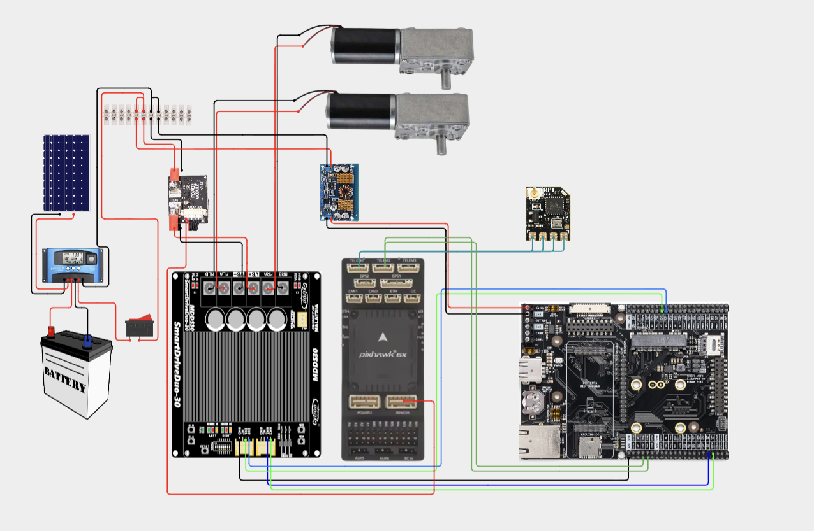

# OrcaMK2

Firmware for the Portenta H7 robot, with two DC geared motors driven by a Cytron MDDS30 and a Pixhawk 6X connected over MAVLink.

The active firmware is ordinary C++ (`.cpp` and `.h`) at the repository root. The original Arduino sketch is preserved in `OrcaMK1_DualDrive_legacy/` and is excluded from the build.

Current modes are **Manual RC** and **Auto forward with collision recovery**. GPS waypoint navigation is not implemented yet.

## Build and upload

Install [PlatformIO Core](https://docs.platformio.org/en/latest/core/installation/index.html), or the PlatformIO IDE extension for VS Code. Open the repository root and run:

```sh
pio run
```

PlatformIO installs the pinned STM32 platform and MAVLink dependency automatically. The target is the **Portenta H7 M7 core**; the firmware is written to `.pio/build/portenta_h7_m7/firmware.bin`.

Arduino IDE is not needed. The [official PlatformIO board support](https://docs.platformio.org/en/stable/boards/ststm32/portenta_h7_m7.html) uses the Arduino framework for GPIO, PWM, timing and serial communication. Removing that framework would require a separate hardware port.

**Disconnect motor power before uploading:** startup briefly pulses both motors, and Auto mode can start driving before receiving an RC command.

Connect the Portenta over USB, then upload:

```sh
pio run --target upload
```

Uploading uses the existing DFU bootloader. If automatic reset fails, [double-press reset to enter bootloader mode](https://support.arduino.cc/hc/en-us/articles/4404067649554-Update-the-bootloader-on-Portenta-H7-boards) and retry. Use `pio device list` to list USB serial ports; add `--upload-port <port>` when a specific port is needed.

For the USB serial monitor:

```sh
pio device monitor
```

The monitor is configured for 57600 baud. The firmware currently emits no debug text; `Serial1` is the separate MAVLink connection to the Pixhawk.

## Where to make changes

| File | Responsibility |
| --- | --- |
| [`config.h`](config.h) | Pin assignments, baud rate, motor speeds, RC deadband, collision threshold and timing. Start here for tuning. |
| [`main.cpp`](main.cpp) | `setup()` and `loop()`: serial startup, status LED, motor initialization and the main update call. |
| [`motors.cpp`](motors.cpp) / [`motors.h`](motors.h) | Motor PWM/direction outputs, startup pulses, movement commands and manual skid-steer mixing. |
| [`pixhawk.cpp`](pixhawk.cpp) / [`pixhawk.h`](pixhawk.h) | MAVLink heartbeat, RC mode selection, collision recovery and connection timeout. Owns its control state privately. |
| [`platformio.ini`](platformio.ini) | Board, dependencies, source files, upload and monitor settings. |
| [`tests/`](tests/) | Host behaviour check using simulated serial, pins and time. |
| [`OrcaMK1_DualDrive_legacy/`](OrcaMK1_DualDrive_legacy/) | Unmodified original sketch, kept for reference only. |

`platformio.ini` explicitly builds only `main.cpp`, `motors.cpp` and `pixhawk.cpp`. Add new firmware `.cpp` files to `build_src_filter` when extending the project; tests and legacy files are not firmware inputs. Keep motor control and MAVLink handling in their own modules.

## Control flow

1. `setup()` starts both serial ports, flashes the blue LED three times, pulses each motor and starts the link timeout.
2. `loop()` calls `pixhawk::update()`.
3. Each update sends a heartbeat when due, checks the connection timeout, then handles incoming MAVLink messages.
4. Manual mode mixes CH2 throttle and CH1 steering into left/right motor commands. Auto mode drives forward and processes `SCALED_IMU2` acceleration for collision detection.

The rewrite preserves the existing motor directions, delays, RC mixing and mode behaviour. It does not add a separate M4 application.

### RC controls and LEDs

| Input | Action |
| --- | --- |
| CH1 | Steering in Manual mode. |
| CH2 | Forward/reverse in Manual mode. |
| CH5 > 1500 microseconds | Manual mode; blue LED. |
| CH5 <= 1500 microseconds | Auto mode; green LED. |

A mode change first stops the motors. Collision recovery shows cyan; a communication timeout shows red.

### Existing control limitations

- Startup includes motor pulses and defaults to Auto. Motor output is not gated by the Pixhawk's armed state.
- Collision recovery stops, reverses, stops, pivots, stops and drives forward again. Its blocking delays pause RC processing and timeout checks for about 11 seconds. Commands queued during recovery are discarded afterward.
- The two-second connection timeout is refreshed by any successfully parsed MAVLink message. It does not separately detect stale RC input or validate the sender's identity.

These behaviours are retained for compatibility and still need hardware/field testing. Responsive recovery and explicit arming should be addressed before expanding autonomous operation.

## Hardware and wiring

- Arduino Portenta H7 with Portenta Breakout Board.
- Holybro Pixhawk 6X, with the RC receiver connected to the Pixhawk.
- Cytron MDDS30 SmartDriveDuo and two DC geared motors.
- Battery, solar panel/charge controller, switch, power module and DC-DC converter.

| Connection | Portenta pin |
| --- | --- |
| Left motor PWM / direction | D6 / A3 |
| Right motor PWM / direction | D5 / A4 |
| Pixhawk UART | `Serial1`, 57600 baud |



[Full-size wiring diagram](docs/images/orca-hardware-wiring.png) · [Cirkit Designer project](https://app.cirkitdesigner.com/project/8dd8c75b-f0f1-4eca-acd8-ed756c08ec5a)

## Check firmware behaviour without the robot

After `pio run` installs MAVLink, use a host C++ compiler (`c++`, or set `CXX`) and a POSIX shell:

```sh
sh tests/check_firmware.sh
```

The check compiles the actual root-level firmware against a small hardware stub and feeds it real MAVLink packets. It checks RC direction/mixing, deadband, output saturation, mode changes, communication timeout, collision recovery and heartbeat output. It does not upload firmware or replace testing on the robot.

Original firmware by Nazrin Hakeem Bin Khalid, August 2026; preserved in the legacy directory.
